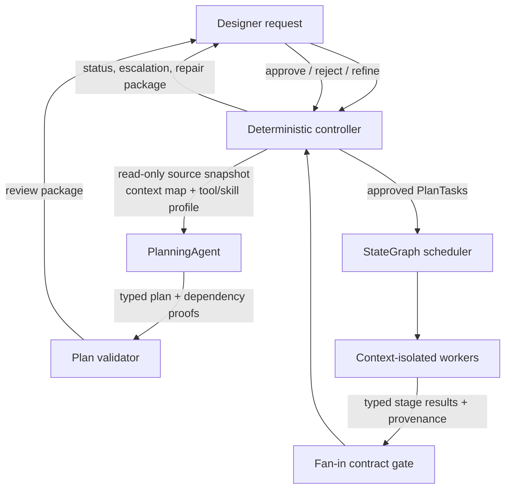

# Coordination and Specification-Preprocessing Delta Plan

**Status:** Approved and implemented as package version `0.3.0`; see `coordination-and-specification-preprocessing-implementation.md` for tested scope and explicit limitations.
**Purpose:** Close the currently unimplemented portions of the systems-design document that concern deterministic orchestration, lateral worker exchange, input-document preprocessing, task-aware context selection, and Gate 1 specification artifacts.
**Model boundary:** No model provider, multimodal model, or EDA executable will be selected or invoked until the project owner supplies the relevant identifiers and explicitly enables those integrations.

## Direct answer to the audit question

**No. The current `0.2.0` harness does not implement all material in the systems-design document.** It implements useful foundations: typed `PlanTask` validation, a generic state-graph scheduler, policy-bound tool execution, task-local episode mechanics, run state, and a single scripted planner-to-RTL-worker vertical slice. It does **not** implement the complete controller workflow, a durable cross-worker discovery substrate, document preprocessing, unified specification construction, task-aware document retrieval, gap analysis, soft-locking, or version history.

The current graph is therefore a coordination *primitive*, not yet the complete vertical and lateral coordination design.

| Concern | Present implementation | Missing behaviour required by the document |
|---|---|---|
| **Vertical coordination** | `HarnessCoordinator` validates and starts a plan; `StateGraph` schedules a supplied executor; `BaseAgent` can return an escalation. | A controller-owned state machine that classifies work complexity, puts the source of truth in read-only mode, selects a skill/tool subset, asks for plan approval, dispatches workers, performs bounded repair loops, aggregates stage outcomes, and escalates unresolved failures to the user. [1] [2] [3] |
| **Lateral coordination** | Independent nodes can execute concurrently; plan dependencies and fan-in exist. `EpisodeRecord.owner_id` identifies an owner. | A **durable run-scoped shared substrate** through which a worker publishes a typed exploratory discovery and a different worker’s action explicitly consumes that episode. No worker-to-worker transcript or mailbox is permitted. The current `BaseAgent` creates a private in-memory episode store for each run, so it cannot currently perform this cross-worker handoff. [4] [5] |
| **Parallel-worker agreement** | Plan validator derives signal order before execution. | A deterministic provenance-hash/contract gate that validates independently produced artifacts and contracts at fan-in. The current `GraphNodeResult.provenance_hash` is a field only; it is not computed or checked. [4] |
| **Specification preprocessing** | `read_spec` reads a pre-populated string from a task context. | Manifest ingestion; format-specific extraction; diagram/image extraction; ordered mixed-document trees; source spans; validation/review state; and persisted unified-specification artifacts. [6] [7] [8] [9] |
| **Task-aware context** | BaseAgent assembles a scoped task after the caller supplies it. | Design-stage-to-specification mapping, tree pruning, keyword extraction, matching, and source-grounded context selection from the unified specification. [10] [11] [12] |
| **Gate 1 / versioning** | Not implemented. | Gap reports, soft-lock approval, unified specification folder, dependency graph, version metadata, saved plans, deterministic version classification, and repository-level tags/branches. [13] [14] [15] [16] |

## Coordination design to implement

### Vertical controller path

The implementation will add `orchestration.py` and a run-scoped `ControllerState`. The controller will express the upward and downward path entirely as typed events and records, not assistant/worker dialogue:



`ControllerCommand` will include `request_plan`, `submit_plan`, `approve_plan`, `reject_plan`, `dispatch`, `record_node_result`, `request_repair`, `cancel`, and `resolve_escalation`. A deterministic complexity router will use the documented `GapReport` metadata—`categories_touched`, `blast_radius`, and gap type—to choose a single-worker or multi-worker run. A `SkillToolProfile` will capture the controller-selected read-only snapshot, stage mapping, allowed capabilities, and matched skills before an agent call. The controller will cap repairs, retain every decision in the run record, and require user approval before dispatching an accepted plan.[1] [2] [3]

A live event log will expose controller, graph, tool, and process events. It will support observation and cancellation, but it will never expose unbounded hidden reasoning traces. The document calls for the harness—not a model—to be the deterministic watchdog with authority to interrupt execution.[17]

### Lateral worker path

The implementation will add `shared_state.py` and replace per-invocation private memory with a `RunEpisodeStore` shared by the graph executor. It will have the following typed records:

| Record | Purpose | Invariant |
|---|---|---|
| `SharedSubstrateSnapshot` | Immutable specification/artifact snapshot with version and content hash. | Workers read the same named snapshot; they do not mutate it. |
| `ExploratoryDiscovery` | A closed exploratory episode published by a producing node, including source spans, snapshot version, and provenance hash. | The content must be a discovery not already copied into the consumer’s locked interface. |
| `LateralDependencyRequest` | A consumer action’s request to depend on a producer discovery. | The referenced episode must be closed, exploratory, run-scoped, and generated by a completed producer node. |
| `SharedStateWrite` | Versioned typed graph-state output. | Schema and producer node ID are fixed; prose transcripts are prohibited. |
| `ProvenanceRecord` | Canonical hash over node inputs, source references, tool records, artifact IDs, and result schema version. | Fan-in contract gates verify hashes before accepting outputs. |

A lateral edge is added only when a worker action needs an emergent discovery that is not present in its copied locked interface. The scheduler will then add a dynamic graph dependency and expose only the cited discovery record to the consumer action. Parallel workers otherwise remain isolated. This matches the document’s action→exploratory rule and its prohibition on shared worker conversations.[4] [5]

### Fan-in contract gates

`ProvenanceContractGate` will become a deterministic node at stage joins. It will validate result-schema version, input artifact hashes, source snapshot versions, locked-interface compatibility, expected producer/consumer relationships, and duplicate/contradictory signal outputs. The gate will return a typed accepted/rejected report. Rejection creates a bounded controller repair request; it does not invite workers to negotiate by chat.[4]

## Specification preprocessing and document tooling to implement

### Persisted inputs and unified representation

The pipeline will use a YAML-first manifest because the document’s proposed collation tree is YAML and should point to source documents without duplicating their full content.[6] The manifest will be a typed `SpecificationManifest` containing the source category, document identifier, title, format, relative path, optional requirement/assumption metadata, and declared dependencies. Relative paths are resolved beneath one configured specification root; path traversal and missing files fail deterministically.

Every extracted item will produce an ordered `DocumentTree` with typed nodes in reading order. Each node has a required `SourceRef` containing document ID, source content hash, original relative path, format, and one or more location selectors such as page, paragraph, table coordinates, XML path, worksheet/range, or line span. This makes the selected context source-grounded and allows later `PlanTask.scope` references to be copied verbatim.

```text
specifications/
├── specification-manifest.yaml       # category tree and document pointers
├── processed/
│   ├── REQ-ARCH-001.document.yaml    # DocumentTree with source references
│   ├── REQ-IFACE-001.document.yaml
│   └── ...
├── unified-specification.yaml        # graph of documents, requirements, assumptions, links
├── dependency-graph.yaml
├── gap-report.yaml
├── plans/
└── version-metadata.yaml
```

### Deterministic parsers

The first implementation will parse the document classes explicitly listed in the design document. The result is text/table/structured nodes with source references; it is not an untraceable summary.

| Input family | First implementation | Required output |
|---|---|---|
| `.txt`, `.md`, `.tex` | Line-preserving text extraction; Markdown tables; TeX equations/tables retained as source-backed text blocks. | Ordered text and table nodes with line spans. |
| `.docx` | Word XML paragraphs, headings, and tables; relationship inspection for embedded images. | Ordered text/table/image placeholder nodes with paragraph/table locations. |
| `.pdf` | Page-aware text extraction and page image enumeration. | Page-backed text nodes and image placeholders with page/ordinal coordinates. |
| `.csv`, `.xlsx` | Header-aware structured table extraction. | Table nodes with worksheet/range or row/column provenance. |
| `.yaml`, `.json`, XML/IP-XACT, `.sdc`, `.upf`, SystemRDL | Structural/source-preserving parsers. XML is parsed with XML-path references. The initial SDC/UPF/SystemRDL representation preserves statements and line spans; semantic language compilers are a follow-up only when their exact grammar/toolchain is selected. | Structured-record or line-backed statement nodes. |
| PlantUML, DOT, WaveDrom, Mermaid, TikZ, SVG, draw.io/Visio XML | Direct source/structured extraction where the source is declarative or XML. SVG/draw.io/Visio receive structure-aware parse attempts before any vision route. | Diagram-source/graph nodes with source spans and parsed entities where deterministic. |
| PNG/JPEG and unstructured vector/raster diagrams | Image asset, local surrounding text, captions, and filename context are retained; extraction is routed through a typed vision-adapter protocol. | `ImageNode` plus a validated proposal or explicit review-required state. |

The direct-parse versus vision-routing split follows the document’s separate text/image/mixed-document rules.[7] [8] For mixed documents, text extraction occurs first; image placeholders are then resolved with captions and adjacent text; the final `DocumentTree` preserves text-block, table-block, and image-node order.[9] [10]

### Diagram routing and human review

The `VisionAdapter` interface will be provider-neutral. The deterministic pipeline will classify the image route using its format/structure and an adapter-supplied confidence record. A valid high-confidence response can pass a strict typed schema after at most three attempts. Low confidence, malformed output after the retry cap, or an unconfigured vision adapter returns an editable `ReviewRequired` record instead of fabricated diagram semantics. This directly implements the document’s classifier → skill selection → structured validation/retry → user review sequence while preserving the current no-model-identifier boundary.[11] [18]

The initial package will contain `ScriptedVisionAdapter` tests and `UnconfiguredVisionAdapter`. A real multimodal adapter remains an opt-in follow-up when the project owner gives a concrete provider/model identifier and credentials. No claim will be made that a diagram was understood by a real multimodal model before that test runs.

### Task-aware retrieval and Gate 1 artifacts

`context_selection.py` will implement the source-provided stage matrix for Architecture Exploration, RTL Development, RTL Verification, Synthesis/DFT, Physical Design, Firmware Development, Safety/Security Analysis, and Signoff. A deterministic selector will first prune the manifest by stage category, then match exact scope pointers, requirement identifiers, and normalized task keywords. The agent receives only the selected `DocumentTree` nodes and their source references; it does not receive the entire specification tree.[12] [19]

`specification_gate.py` will add deterministic absence, traceability, and verifiability checks. Its typed `GapReport` will include the source-required fields and distinguish model-needed ambiguity, semantic inconsistency, and unstated-assumption analysis from checks the deterministic system can prove.[13] [14] Soft-lock is a typed user decision, never an automatic model conclusion. On lock, the system persists unified-specification, dependency-graph, gap-report, plans, and version metadata under `specifications/`.[15]

Version classification will be deterministic. It will inspect changes to the persisted specification fields against the document’s major/minor/patch triggers. Local Git tag/worktree commands are intentionally **out of scope for the first preprocessing increment**; they affect repository history and require a separate confirmed workflow, even though the design identifies Git tags, branches, and worktrees as the intended later mechanism.[16] [20]

## Implementation sequence

1. **Coordination correctness:** build run-scoped shared state, vertical `ControllerState`, plan approval, bounded repairs/escalations, lateral discovery references, and provenance contract gates. Extend MCP with controller/status/event endpoints and test both directions of coordination.
2. **Source-grounded preprocessing:** add manifest schemas, path-bound document registry, deterministic parsers, ordered document trees, source references, content hashes, and artifact persistence.
3. **Mixed document routing:** add image extraction discovery, deterministic context assembly, vision-adapter protocol, confidence/retry/review state machine, and scripted tests.
4. **Task-aware context and Gate 1:** add stage mapping, tree pruning/matching, unified-specification/dependency graph, deterministic gap checks, soft-lock approval, and version metadata. Leave actual Git tags/worktrees for a separately approved repository-history increment.
5. **MCP and TypeScript façade:** expose ingest/process/select/validate/soft-lock/controller methods from Python through MCP, then compile and run a live TypeScript-to-Python integration test.

## Decisions requested before code changes

| Decision | Recommended choice | Why it affects the implementation |
|---|---|---|
| **Specification source layout** | Use `specifications/specification-manifest.yaml` as the YAML-first entry point and persist processed outputs beneath `specifications/`. | It matches the provided manifest and Gate 1 artifact layout. [6] [15] |
| **Initial vision mode** | Implement the full confidence/retry/review state machine with scripted/unconfigured adapters; defer any real multimodal API call. | A real vision adapter needs a model/provider identifier, which has not been supplied. [11] |
| **Stage scope** | Implement all stage-to-category mappings now, but restrict executable specialist tool contracts to the documented RTLWorker until later stage contracts are sourced. | The stage mapping is specified, but only RTLWorker has a detailed tool contract in the current document. [12] [21] |
| **Git version operations** | Persist deterministic version metadata now; defer creating tags, branches, or worktrees to a separate approval. | The design calls for Git-backed history, but it changes repository state and should be implemented as a focused workflow. [16] |

## References

[1]: /home/ubuntu/upload/Agent-AssistedDesignFrameworkSystemsDesign-updated.pdf "Agent-Assisted Design Framework Systems Design, updated, p. 41, lines 2–12"
[2]: /home/ubuntu/upload/Agent-AssistedDesignFrameworkSystemsDesign-updated.pdf "Agent-Assisted Design Framework Systems Design, updated, p. 42, lines 2–13"
[3]: /home/ubuntu/upload/Agent-AssistedDesignFrameworkSystemsDesign-updated.pdf "Agent-Assisted Design Framework Systems Design, updated, p. 43, lines 2–11"
[4]: /home/ubuntu/upload/Agent-AssistedDesignFrameworkSystemsDesign-updated.pdf "Agent-Assisted Design Framework Systems Design, updated, p. 60, lines 2–19"
[5]: /home/ubuntu/upload/Agent-AssistedDesignFrameworkSystemsDesign-updated.pdf "Agent-Assisted Design Framework Systems Design, updated, p. 63, lines 2–26"
[6]: /home/ubuntu/upload/Agent-AssistedDesignFrameworkSystemsDesign-updated.pdf "Agent-Assisted Design Framework Systems Design, updated, pp. 22–23, lines 2–12 and 2–48"
[7]: /home/ubuntu/upload/Agent-AssistedDesignFrameworkSystemsDesign-updated.pdf "Agent-Assisted Design Framework Systems Design, updated, p. 24, lines 2–12"
[8]: /home/ubuntu/upload/Agent-AssistedDesignFrameworkSystemsDesign-updated.pdf "Agent-Assisted Design Framework Systems Design, updated, pp. 25–26, lines 2–12 and 2–11"
[9]: /home/ubuntu/upload/Agent-AssistedDesignFrameworkSystemsDesign-updated.pdf "Agent-Assisted Design Framework Systems Design, updated, p. 29, lines 2–11"
[10]: /home/ubuntu/upload/Agent-AssistedDesignFrameworkSystemsDesign-updated.pdf "Agent-Assisted Design Framework Systems Design, updated, p. 30, lines 6–16"
[11]: /home/ubuntu/upload/Agent-AssistedDesignFrameworkSystemsDesign-updated.pdf "Agent-Assisted Design Framework Systems Design, updated, pp. 27–28, lines 2–30 and 2–16"
[12]: /home/ubuntu/upload/Agent-AssistedDesignFrameworkSystemsDesign-updated.pdf "Agent-Assisted Design Framework Systems Design, updated, pp. 31–33, lines 2–10, 1–32, and 2–20"
[13]: /home/ubuntu/upload/Agent-AssistedDesignFrameworkSystemsDesign-updated.pdf "Agent-Assisted Design Framework Systems Design, updated, p. 38, lines 2–29"
[14]: /home/ubuntu/upload/Agent-AssistedDesignFrameworkSystemsDesign-updated.pdf "Agent-Assisted Design Framework Systems Design, updated, p. 39, lines 2–27"
[15]: /home/ubuntu/upload/Agent-AssistedDesignFrameworkSystemsDesign-updated.pdf "Agent-Assisted Design Framework Systems Design, updated, p. 48, lines 2–13"
[16]: /home/ubuntu/upload/Agent-AssistedDesignFrameworkSystemsDesign-updated.pdf "Agent-Assisted Design Framework Systems Design, updated, pp. 45–47, lines 2–13, 2–13, and 2–16"
[17]: /home/ubuntu/upload/Agent-AssistedDesignFrameworkSystemsDesign-updated.pdf "Agent-Assisted Design Framework Systems Design, updated, pp. 53–54, lines 9–67 and 2–12"
[18]: /home/ubuntu/upload/Agent-AssistedDesignFrameworkSystemsDesign-updated.pdf "Agent-Assisted Design Framework Systems Design, updated, p. 8, lines 2–12"
[19]: /home/ubuntu/upload/Agent-AssistedDesignFrameworkSystemsDesign-updated.pdf "Agent-Assisted Design Framework Systems Design, updated, p. 32, lines 1–32"
[20]: /home/ubuntu/upload/Agent-AssistedDesignFrameworkSystemsDesign-updated.pdf "Agent-Assisted Design Framework Systems Design, updated, p. 47, lines 2–16"
[21]: /home/ubuntu/upload/Agent-AssistedDesignFrameworkSystemsDesign-updated.pdf "Agent-Assisted Design Framework Systems Design, updated, p. 66, lines 2–17"
