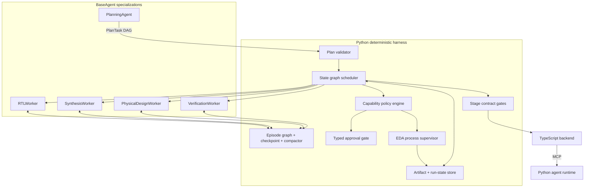

# Full Agent Harness Implementation Plan

**Status:** Approved and implemented as the `0.2.0` harness foundation; extended by the `0.3.0` controller and preprocessing increment documented in `coordination-and-specification-preprocessing-implementation.md`.
**Scope:** Extend the Python-first `packages/agent-sdk` from a single BaseAgent loop into the deterministic harness needed to coordinate specialized RTL-to-GDSII agents.
**Model status:** The harness will remain model-provider-neutral and use deterministic scripted adapters until the project owner supplies a real model identifier.

## Recommendation

Build the remaining harness as a **Python deterministic execution substrate** behind the existing MCP boundary. The reasoning agents will remain instances of the existing `BaseAgent` contract. The planner, workers, verification agents, and any future stage supervisor are therefore not a separate kind of uncontrolled process. They receive one typed task, a narrow capability set, and a typed terminal result. The controller, graph scheduler, plan validator, artifact store, policy engine, process supervisor, and contract gates remain deterministic modules and do not inherit `BaseAgent`.[1]

OpenHarness is a useful implementation reference for typed tool schemas, pre/post lifecycle interception, permission ordering, session persistence, task lifecycle records, and process termination. It is **not** the coordination model to copy. OpenHarness retains a mutable conversation and sends coordinator/worker notifications through messages. The target framework prohibits shared conversation between agents. It requires workers to exchange typed `PlanTask`, `ToolResult`, and `AgentResult` records through a deterministic graph and shared read-only substrate.[2] [11] [12]

## Target architecture

The graph is the only inter-agent communication channel. Every edge carries a versioned typed record. An agent never receives another agent’s transcript. Parallel workers see only their own `PlanTask`, the verbatim locked interface, authorized artifacts, and read-only substrate. Agreement and interface conflicts are mechanically checked rather than negotiated in dialogue.[2]

## Incremental implementation plan

### Increment 1 — Typed planning and graph coordination

Create `planning.py`, `graph.py`, and `plan_validation.py`.

`PlanTask` will contain `task_id`, exact copied `scope`, verbatim `locked_interface`, explicit instructions, task dependencies, acceptance-gate identifier, and a model tier. `TaskSignalUse` and `DependencyProof` will make task-order claims auditable. The deterministic plan validator will recompute pairwise signal-derived edges; reject missing citations, competing producers, contradictory orders, cycles, interface overlaps, duplicate task IDs, and dependency sets that differ from the recomputed graph. This follows the provided schema and validation algorithm.[3] [4]

`StateGraph` will represent four node kinds—agent invocation, deterministic gate, pure function, and bounded elastic node—and static, conditional, fan-out, and fan-in edges. It will expose deterministic state transitions: `pending → runnable → running → completed | failed | blocked | cancelled`. Fan-in nodes will run only after all required predecessors have typed terminal results. An elastic child requires an explicit spawn record, parent task ID, declared scope, depth cap, global cap, and escalation rule.[2]

The first planner and worker specializations will be contract factories plus scripted-model integration tests. They will not claim planning or EDA intelligence before a real model is configured.

### Increment 2 — Capability-bound tools, policy, approvals, and supervised execution

Create `tool_registry.py`, `policy.py`, `approvals.py`, `artifacts.py`, and `supervisor.py`.

Tools will be Python classes with Pydantic argument/output models, a capability identifier, side-effect classification, declared artifact inputs/outputs, and deterministic metadata. The initial catalog will implement safe file/artifact actions and structured EDA command actions:

| Tool family | First tools | Enforcement boundary |
|---|---|---|
| Read-only substrate | `read_spec`, `read_artifact`, `grep_artifact` | Content-addressed IDs, allowed source spans, read-only run root. |
| Draft mutation | `write_draft`, `diff_declared_artifacts` | Declared output paths only; immutable locked-interface validation; artifact manifest. |
| RTL checks | `run_verilator`, `run_yosys` | Registered command templates and declared inputs; supervisor-managed subprocess. |
| Physical-design checks | `run_openroad`, `run_opensta`, `parse_report` | Registered templates, per-tool limits, approved run root, output manifest. |
| Harness support | `open_episode`, `close_episode`, `request_approval` | Typed state updates only; no arbitrary shell capability. |

The policy engine will decide before process creation. It will validate the capability token, agent role, PlanTask scope, declared input and output paths, command template, resource profile, and approval requirement. Policy evaluation will be deny-by-default. It adapts OpenHarness’s explicit tool schema and ordered permission checks, but it does not grant the unrestricted `full_auto` model or rely on a generic shell command as EDA isolation.[13]

Pre-tool hooks may deny execution, enrich audit metadata, or request a typed approval gate. Post-tool hooks may attach manifests, metrics, provenance, and lifecycle records. Neither hook type will supervise a running subprocess. The EDA process supervisor will create a process group, capture bounded logs, enforce a wall-time limit, pass cancellation through terminate-then-kill escalation, record exit status, and return an immutable execution record. This boundary follows the system design’s separation of hook interception from mid-execution process supervision.[5]

### Increment 3 — Episode memory, compaction, and resumable run state

Replace the initial `InMemoryEpisodeGraph` with an episode-store protocol and two implementations: a test in-memory store and a durable JSON/SQLite-free file store under a configured run root.

Each episode will add the framework-defined fields: `substrate_backed`, `snapshot_version`, `closed`, `depends_on`, `depended_on_by`, and an exploratory description. The harness will only permit closing an action episode if each dependency is a closed exploratory episode. The graph will maintain reverse dependency edges mechanically. A cross-agent dependency is legal only when a consuming action explicitly depends on a discovering worker’s closed exploratory episode.[6]

A deterministic compactor will enforce the document’s eligibility and priority rules. It will not delete an active episode or one with live dependents. EDA action episodes require a complete input/output manifest before they become eviction candidates. If nothing can be compacted, it returns a named `CONTEXT_DEADLOCK` dossier; it does not silently discard state. Checkpoints will persist structural graph metadata and a graph hash, not raw transcripts. Resume validates schema versions, graph hash, artifact hashes, and terminal process records before any node becomes runnable.[7]

OpenHarness’s atomic snapshot, project-scoped path, and tool-result-pair-preserving compaction patterns are useful references, but prompt-injected markdown memory will never be treated as authoritative execution state in this harness.[14]

### Increment 4 — Agent coordination, stage contracts, and MCP surface

Create `coordination.py`, `specialists.py`, and `mcp_harness.py`.

The scheduler will launch independent graph nodes concurrently only when their dependencies and resource profile permit it. A stage result will be a typed envelope containing `run_id`, `node_id`, `task_id`, schema version, status, artifact IDs, diagnostics, tool trace references, provenance hash, and escalation. The scheduler will perform deterministic fan-in and contract gates. It will neither parse free-form worker dialogue nor use a mailbox as the source of truth.

Specialist definitions will initially include `PlanningAgent`, `RTLWorker`, `SynthesisWorker`, `PhysicalDesignWorker`, and `VerificationWorker`. Only `RTLWorker` has a detailed first tool contract from the framework, so its factory will be fully specified first. The remaining role factories will expose only capabilities and result schemas justified by approved stage contracts; unsupported EDA stage semantics will remain explicit placeholders.[8]

The Python MCP service will add typed lifecycle tools such as `validate_plan`, `start_run`, `get_run_state`, `cancel_run`, `submit_approval`, and `resume_run`. The TypeScript backend will receive run status and typed results over MCP. It will not become a second orchestration engine.

## Decisions requested

The following decisions materially change persisted state, process authority, and product behaviour. They should be made before implementation.

| Decision | Recommended choice | Why it is the smallest safe first implementation |
|---|---|---|
| **Durable run-state store** | Versioned JSON files under the configured workspace/run root, with atomic replacement; add SQLite only after concurrency requirements are demonstrated. | This provides checkpoints, forensic records, and resume tests without introducing a database lifecycle before the graph semantics stabilize. |
| **EDA execution mode** | Real local subprocess supervisor with tool binaries disabled by default until a per-tool registered template is configured. | The harness and cancellation path can be tested safely with deterministic fake processes. A configured Verilator/Yosys/OpenROAD command becomes explicit authority rather than implicit shell access. |
| **Approval policy** | Require a typed approval gate for every mutating artifact write, physical-design launch, signoff/export, and destructive cleanup; permit declared read-only actions automatically. | This corresponds to a stage gate, is auditable, and avoids a prose approval conversation. |
| **Initial graph scope** | Implement the generic graph plus PlanningAgent and RTLWorker end-to-end first; publish other specialist factories with no ungrounded tool semantics. | Only the RTLWorker’s tool contract is specified in the present design document.[8] |

## Validation plan

Unit tests will prove each invariant without a model key or external EDA binary: plan-edge recomputation; conflict/cycle rejection; role and path policy denial; approval wait/resume; process timeout/cancellation with a controlled test process; action-to-exploratory episode dependencies; manifest-gated compaction; deadlock dossier; checkpoint hash mismatch; deterministic fan-out/fan-in; elastic-child caps; and typed MCP run lifecycle results.

Integration tests will run a scripted planner and RTLWorker over a temporary run root. They will create a typed plan, validate it, execute allowed fake tools, produce artifact manifests, pass the RTL result gate, checkpoint state, and resume safely. A real-model integration remains separate and opt-in until the model identifier is supplied.

## OpenHarness adaptations and exclusions

OpenHarness verifies useful patterns: typed Pydantic tool contracts, pre/post hook events, capability checks before tool execution, path/command policy, atomic state files, process termination, explicit task records, and addressed result correlation.[11] [13] [14] [15]

The target will not reuse OpenHarness’s mutable shared conversation, message/XML result routing, generic shell authority, or its implicit assumptions about software-agent task safety. The provided framework explicitly selects deterministic graph state and mechanical agreement checks instead.[2]

## References

[1]: /home/ubuntu/upload/Agent-AssistedDesignFrameworkSystemsDesign-updated.pdf "Agent-Assisted Design Framework Systems Design, updated, p. 50, lines 4–14"
[2]: /home/ubuntu/upload/Agent-AssistedDesignFrameworkSystemsDesign-updated.pdf "Agent-Assisted Design Framework Systems Design, updated, p. 60, lines 2–19"
[3]: /home/ubuntu/upload/Agent-AssistedDesignFrameworkSystemsDesign-updated.pdf "Agent-Assisted Design Framework Systems Design, updated, p. 58, lines 2–22"
[4]: /home/ubuntu/upload/Agent-AssistedDesignFrameworkSystemsDesign-updated.pdf "Agent-Assisted Design Framework Systems Design, updated, p. 59, lines 2–30"
[5]: /home/ubuntu/upload/Agent-AssistedDesignFrameworkSystemsDesign-updated.pdf "Agent-Assisted Design Framework Systems Design, updated, p. 55, lines 2–14"
[6]: /home/ubuntu/upload/Agent-AssistedDesignFrameworkSystemsDesign-updated.pdf "Agent-Assisted Design Framework Systems Design, updated, p. 63, lines 2–26"
[7]: /home/ubuntu/upload/Agent-AssistedDesignFrameworkSystemsDesign-updated.pdf "Agent-Assisted Design Framework Systems Design, updated, p. 64, lines 2–21"
[8]: /home/ubuntu/upload/Agent-AssistedDesignFrameworkSystemsDesign-updated.pdf "Agent-Assisted Design Framework Systems Design, updated, p. 66, lines 2–17"
[9]: https://modelcontextprotocol.io/specification/2026-07-28/basic/transports "Model Context Protocol specification: transports"
[10]: https://py.sdk.modelcontextprotocol.io/ "MCP Python SDK: typed tool server"
[11]: https://github.com/HKUDS/OpenHarness "OpenHarness README: harness subsystems"
[12]: https://github.com/HKUDS/OpenHarness/blob/main/src/openharness/engine/query.py "OpenHarness agent loop and tool dispatch"
[13]: https://github.com/HKUDS/OpenHarness/blob/main/src/openharness/permissions/checker.py "OpenHarness permission checker"
[14]: https://github.com/HKUDS/OpenHarness/blob/main/src/openharness/services/session_storage.py "OpenHarness session snapshot persistence"
[15]: https://github.com/HKUDS/OpenHarness/blob/main/src/openharness/tasks/manager.py "OpenHarness task lifecycle manager"
