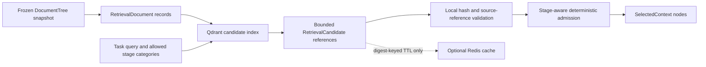

# Grounded Retrieval, Dependency Impact, and Structural Versioning

**Status:** Implemented in Agent SDK 0.15.0.
**Scope:** Deterministic transitive dependency impact, snapshot-backed structural specification classification, Qdrant candidate retrieval, and an optional Redis cache.

## Design conclusion

The SDK treats vector search as an **untrusted candidate-ranking service**, not as an authority for specification facts. The frozen local `DocumentTree` remains authoritative. A retrieval candidate is usable only after its snapshot identifier, category, document identifier, node identifier, source hash, and source location match the locally held tree. The stage-aware selector then admits only those verified nodes permitted by its deterministic category matrix.[1] [2]

> **A vector store may rank source references. It may not grant a capability, alter a requirement, create a graph edge, approve a lock, replace source provenance, or inject backend-provided text directly into model context.**

This boundary follows the framework’s requirement to preserve pointers to structured source material and load context by task rather than place every specification document—or an untraceable summary—into every prompt.[1] The design also preserves the SDK’s state-first context model: retrieval is source evidence, not a replacement conversation, graph state, audit ledger, or project state.[3]

## Retrieval architecture



`specification_retrieval_documents()` turns each non-empty frozen `DocumentNode` into an index record with a deterministic stable identifier. Its metadata contains `snapshot_id`, category, document/node identifiers, and complete `SourceRef`; the text is used only by the configured embedding/index backend. `GroundedRetrievalService.retrieve()` filters every result to the requested snapshot and allowed categories. `resolve()` then matches each candidate against local source data before returning a node. `TaskAwareContextSelector.select_verified_retrieval_nodes()` enforces the documented stage-category matrix once more before the node can become selected context.[4] [5]

The optional `QdrantRetrievalIndex` creates a collection with cosine vectors and keyword payload indexes for `snapshot_id` and category. Every search applies both metadata filters. This uses Qdrant’s documented payload filtering model; creating payload indexes before ingestion is the documented performance path for fields used as filters.[6]

A `DeterministicLexicalRetrievalIndex` is included for tests, offline development, and deterministic fallback. It ranks by normalized lexical-overlap count and stable document/node ordering. It is not described as semantic retrieval. When Qdrant or the embedding host is unavailable, `GroundedRetrievalService` returns an explicit `unavailable` result by default, rather than inventing a result; a host may choose rejection instead.[4]

## Redis is cache-only

`RedisRetrievalCache` is optional and installed through `agent-design-agent-sdk[redis-cache]`. It caches only a bounded `RetrievalResult`: query digest, snapshot/category-filtered candidate references, ranks, backend name, and TTL. It never stores raw query text, raw source text, requirements, `StateGraph`, approvals, version locks, telemetry, audit logs, model credentials, or tool evidence. Its key is a digest of snapshot, query text, allowed categories, limit, and retrieval policy; this avoids indexing the raw query as a Redis key.[4]

Redis is not a second vector database in this design. Redis can support vector indexes and metadata filters, but enabling it as another index would introduce a second retrieval authority and a migration/consistency problem without a distinct requirement.[7] Qdrant is retained as the one optional vector index; Redis accelerates repeat lookup only.

Neither optional service is started, configured, or required by the SDK. They are external dependencies selected and operated by the embedding host. Normal unit tests use fakes and the in-memory cache. No real embedding provider, Qdrant service, or Redis service was contacted for this implementation.

## Local host pattern

The host owns the embedding provider and optional service credentials. The example below uses a deterministic local index rather than claiming a provider integration:

```python
from agent_sdk import (
    DeterministicLexicalRetrievalIndex,
    GroundedRetrievalService,
    RetrievalQuery,
    SpecificationCategory,
)

index = DeterministicLexicalRetrievalIndex()
retrieval = GroundedRetrievalService(index)
retrieval.index_snapshot("spec-lock-v1", frozen_document_trees)

result = retrieval.retrieve(
    RetrievalQuery(
        snapshot_id="spec-lock-v1",
        query_text="ready valid timing",
        allowed_categories=[SpecificationCategory.FUNCTIONAL, SpecificationCategory.INTERFACE],
    )
)
verified = retrieval.resolve(result, frozen_document_trees)
selected = selector.select_verified_retrieval_nodes(
    frozen_document_trees,
    stage,
    verified.nodes,
)
```

For Qdrant, supply a host-local `EmbeddingProvider` and instantiate `QdrantRetrievalIndex`. For Redis caching, install the optional extra and pass `RedisRetrievalCache(redis_url)` to `GroundedRetrievalService`. Provider clients, URLs, credentials, callbacks, and service deployment remain host-local, so MCP intentionally exposes no remote index, query, or credential-registration method.[4]

When telemetry is configured, `RetrievalTelemetrySink` emits only a query digest, snapshot identifier, policy identifier, backend name, result status, candidate count, and failure class. It records `retrieval.candidate_count` and `retrieval.cache_hit_count`; it does not record query text or retrieved source text.[4]

## Dependency blast radius

The Gate 1 dependency graph uses edges in the form `(dependent, prerequisite)`. For a missing prerequisite, `reverse_reachable_nodes()` conducts a deterministic breadth-first traversal over reverse adjacency. It counts every known requirement that depends on the missing identifier transitively and excludes the missing identifier itself. Thus, given `REQ-A → missing`, `REQ-B → REQ-A`, and `REQ-C → REQ-B`, the missing-reference gap has `blast_radius=3`.

This corrects the former constant value of one while retaining a deterministic graph calculation. The framework defines traceability gaps as graph traversal over cross references and records blast radius as the number of downstream requirements affected, so transitive closure is the appropriate interpretation.[2] [8]

`deterministic_cycles()` now supplies the previously duplicated stable depth-first cycle traversal for both Gate 1 and plan validation. It traverses sorted known nodes and excludes unknown endpoints from cycle detection, leaving them for the explicit missing-reference diagnostic.[4]

## Structural version classification

Path-name keywords no longer determine a SemVer recommendation. A `SpecificationVersionService` now persists a content-addressed `SpecificationSnapshotRecord` with every approved lock. When a later tagged specification is classified, the service compares stable requirement IDs, existing requirement text/category/structured fields, and declared dependency edges.

| Structural delta | Required recommended bump |
|---|---|
| First approved lock with no earlier tag | MAJOR baseline |
| Removed requirement | MAJOR |
| Modified text, category, or structured fields of an existing requirement | MAJOR |
| Added or removed dependency edge | MAJOR |
| One or more added requirements, with no breaking delta | MINOR |
| Only source references or acceptance-check metadata changed | PATCH |
| Earlier Git tag lacks a persisted structured snapshot | Automatic classification is refused; an approved baseline lock is required |

The classification is an auditable **policy rule**, not a proof that natural-language semantics are compatible. The full specification digest and Gate 1 lock still protect all fields, including source locators and acceptance metadata. The policy simply distinguishes what requires a new major, minor, or patch number.[4] [9]

`create_lock()` rejects a `VersionMetadata.change_kind` that disagrees with this deterministic classification. This prevents an approved record from labelling a structurally MAJOR update as PATCH; it does not remove the separate requirement for designer approval.[9]

The Python MCP and TypeScript façade now require the current `UnifiedSpecification` and dependency graph when classifying a version. The old path-only endpoint shape cannot make a structural claim safely. The Python runtime remains the classifier; TypeScript validates and forwards data only.[10] [11]

## Validation scope and limits

Focused tests prove transitive blast-radius counting; shared stable cycle detection; path-name independence; MAJOR, MINOR, and PATCH structural classifications; refusal for legacy tags without snapshots; source-hash rejection; snapshot/category filter rejection; cache-hit behavior; stage-bound admission; and digest-only telemetry. Full package validation remains required before a release.

The implementation does not infer semantic compatibility from embeddings, compare arbitrary prose with a model, run Redis or Qdrant in unit tests, invoke an embedding provider, or use retrieval to bypass locked interface, `StateGraph`, approval, or capability policy.[3] [4]

## References

[1]: /home/ubuntu/upload/Agent-AssistedDesignFrameworkSystemsDesign-updated.pdf "Agent-Assisted Design Framework Systems Design, updated, pp. 22–23, structured source pointers and task-aware context loading"

[2]: /home/ubuntu/upload/Agent-AssistedDesignFrameworkSystemsDesign-updated.pdf "Agent-Assisted Design Framework Systems Design, updated, pp. 38–39, deterministic traceability graph traversal and downstream blast radius"

[3]: /home/ubuntu/upload/Agent-AssistedDesignFrameworkSystemsDesign-updated.pdf "Agent-Assisted Design Framework Systems Design, updated, pp. 62–64, episode graph and durable state rather than transcript context"

[4]: ../packages/agent-sdk/src/agent_sdk/retrieval.py "Grounded retrieval contracts, local validation, cache boundary, Qdrant adapter, and telemetry sink"

[5]: ../packages/agent-sdk/src/agent_sdk/context_selection.py "Stage-category pruning and verified retrieval-node admission"

[6]: https://qdrant.tech/documentation/concepts/filtering/ "Qdrant filtering and payload-index guidance"

[7]: https://redis.io/docs/latest/develop/ai/search-and-query/vectors/ "Redis vector index, KNN, and metadata-filter capabilities"

[8]: ../packages/agent-sdk/src/agent_sdk/dependency_graph.py "Deterministic reverse reachability and cycle traversal"

[9]: ../packages/agent-sdk/src/agent_sdk/git_versioning.py "Structural specification snapshots, diffs, classification, and lock persistence"

[10]: ../packages/agent-sdk/src/agent_sdk/mcp_server.py "Structured version-classification MCP contract"

[11]: ../packages/backend/src/agent-runtime/PythonAgentRuntimeClient.ts "Typed TypeScript forwarding façade"
