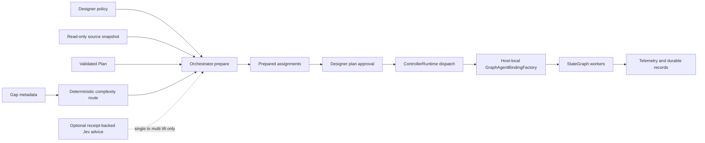

# Governed Orchestration Guide

**Status:** Implemented in Agent SDK 0.14.0.
**Audience:** Embedding-host engineers who need a user-configurable, approval-gated path from a validated ASIC-design plan to one or more graph-bound `BaseAgent` workers.

## Purpose and evidence basis

The orchestration layer is a **deterministic composition boundary**, not a planning model or a second agent runtime. It compiles a user-selected policy, an immutable source snapshot, deterministic gap metadata, and an already-valid `Plan` into auditable worker assignments. This follows the framework’s orchestration requirement to bind a source snapshot, skill/tool profile, and proposed plan before execution.[1] It also follows the documented complexity-routing split between a smaller workflow and a multi-agent workflow, with explicit review before dispatch.[2]

> **Authority rule:** A model, Jev, TypeScript route, or MCP client can neither grant a capability nor create executable worker callbacks. The embedding host retains executable models, credentials, tool handlers, verification callbacks, and the approval decision.[3] [4]

The concrete contracts and lifecycle are implemented in `agent_sdk.orchestrator`; the controller retains vertical lifecycle authority and `StateGraph` remains the only lateral-state carrier.[5] [6] This preserves the framework’s rule that parallel workers coordinate through graph-owned state rather than each other’s transcripts.[3]

## Architecture and lifecycle



`prepare()` validates the supplied typed plan, selected skills, profile overrides, named model bindings, registered tools, capabilities, instance limits, and the total-agent limit. It routes with `ComplexityRouter` before consulting an optional Jev advisor. A valid run is then in `prepared` state. `submit_for_approval()` creates the underlying controller and presents the compiled plan. The only transition to `approved` is a typed human decision. `dispatch_and_execute()` persists `dispatched`, asks the host to build exact worker bindings, checks them against the recorded assignment, and then executes them through `GraphAgentExecutor`. A successful completion is recorded as `executed`; cancellation is persisted as `cancelled`.[5] [6]

| Lifecycle state | Meaning | Permitted next action |
|---|---|---|
| `prepared` | A policy-bound plan and assignments exist, but no controller has been created. | Submit for plan approval. |
| `awaiting-plan-approval` | The controller has accepted the deterministic plan and is waiting for the designer. | Approve, reject, or cancel. |
| `approved` | The designer approved the plan and the controller is dispatch-ready. | Host-local dispatch only. |
| `dispatched` | A graph run has been created. Worker bindings are being validated or executed. | Observe, recover through the host, or cancel. |
| `executed` | Graph execution returned and terminal graph results were reduced into project state. | Read evidence and telemetry. |
| `cancelled` | The orchestration/controller has a retained cancellation decision. | Read evidence only. |

The transition sequence is deliberately persisted before execution. A process restart can reconstruct policy and record data, while a host must explicitly re-register nonserializable model adapters, tool callbacks, and graph bindings before it resumes execution.[5]

## Configure what a run may use

`OrchestrationPolicy` is the user-owned authorization envelope. A `SkillContext` is selected by identifier. A `UserModelSelection` names a serializable `ModelBinding` and the tiers it may serve. An `AgentExecutionProfile` binds a stage and role to the allowed/required skills, allowed named models, closed tool names, one `CapabilityGrant`, and a maximum worker-instance count. Policy-wide fields bound total workers, simultaneous graph workers, repair attempts, and whether multi-agent execution is allowed.[5]

The SDK rejects undeclared tool names and rejects a tool whose registry capability is absent from the assigned profile grant. It also rejects a host worker definition if its identity, exact model binding, node identifier, or tool set differs from the compiled assignment. These checks prevent a request-time policy from being silently widened by host code after approval.[5]

```python
from pathlib import Path

from agent_sdk import (
    AgentExecutionProfile,
    CapabilityGrant,
    ComplexityRoutingRules,
    ModelTier,
    OrchestrationPolicy,
    SkillContext,
    UserModelSelection,
)

policy = OrchestrationPolicy(
    policy_id="rtl-review-policy-v1",
    routing_rules=ComplexityRoutingRules(
        multi_agent_min_categories=2,
        multi_agent_min_blast_radius=3,
        multi_agent_gap_types=["traceability"],
    ),
    skills=[SkillContext(id="rtl-review", version="1.0.0", content="Use locked evidence only.")],
    models=[
        UserModelSelection(
            model_key="selected-provider",
            binding={"provider": "host", "model": "project-selected-model"},
            allowed_tiers=[ModelTier.STANDARD],
        )
    ],
    profiles=[
        AgentExecutionProfile(
            profile_id="rtl-reviewer",
            stage="rtl-development",
            role="rtl-reviewer",
            allowed_skill_ids=["rtl-review"],
            required_skill_ids=["rtl-review"],
            allowed_model_keys=["selected-provider"],
            allowed_tool_names=["read_file"],
            capability_grant=CapabilityGrant(
                role="rtl-reviewer",
                capabilities=["filesystem.read"],
                allowed_paths=["rtl"],
            ),
            max_instances=2,
        )
    ],
    max_total_agents=4,
    max_parallel_agents=2,
    max_repair_attempts=1,
)
```

A request selects a source snapshot, plan, stage, gap metadata, a subset of the policy’s skills, and optional profile overrides by original task ID. Every selected skill must be authorized by at least one resulting assignment. This is intentional: a skill selection is an authorization claim, not a passive UI preference. To make a skill optional, omit it from `selected_skill_ids`; to use it, allow it in an assigned profile.[5]

## Execute through a local host binding factory

Only a Python host can dispatch workers. It supplies `AgentRuntimeServices` rooted at the same run root and a `GraphAgentBindingFactory`. The factory receives `GraphAgentBindingContext`, containing the recorded assignment, selected skill objects, exact model selection, profile, execution task, and immutable source snapshot. It returns a `GraphAgentBinding` with a host-created `AgentModel`, optional tool executor, and optional verification gate registry. The SDK validates the binding before graph execution.[5] [7]

The runnable [`packages/agent-sdk/examples/orchestration.py`](../packages/agent-sdk/examples/orchestration.py) uses `ScriptedModel` solely to demonstrate this boundary. It is not a real provider or an EDA execution claim. A production host replaces the binding factory’s model factory with a selected provider adapter and retains the unchanged authorization, approval, graph-state, verification, and telemetry paths.

The policy’s `max_parallel_agents` is enforced by limiting each deterministic graph wave to the canonical prefix of runnable nodes. Nodes not admitted to the current prefix stay runnable for later waves. This preserves deterministic ordering while preventing the graph executor from exceeding the user-selected concurrent-worker ceiling.[5] [8]

## Jev advisory routing is bounded

The deterministic complexity route is authoritative. `JevArchitectureRouter` receives only a bounded routing projection: stage, gap metadata, task/dependency counts, model tiers, and declared elastic limits. It may lift a deterministic `single-agent` route to `multi-agent` when its host-defined routing policy permits it. It cannot lower a deterministic multi-agent route, override `multi_agent_enabled`, approve a plan, mutate graph state, or authorize a tool.[5] [9]

A production Jev path must use the existing sanitized interoperation contracts and persist a receipt. The MCP payload does not accept a Jev response or evaluator credentials. This avoids treating a caller-supplied advisory decision as trusted evidence and keeps third-party credentials within the host process.[9]

## MCP and TypeScript boundary

The Python MCP service offers a deliberately **data-only** orchestration lifecycle:

| MCP tool | Function |
|---|---|
| `prepare_orchestration` | Persist a validated policy, route, execution plan, and assignments. |
| `get_orchestration` | Retrieve the durable nonsecret orchestration record. |
| `submit_orchestration_for_approval` | Bind the record to a controller and present the plan. |
| `approve_orchestration` | Record the designer’s decision. |
| `cancel_orchestration` | Persist cancellation and cancel the bound controller when present. |

The matching TypeScript client and `/api/agent-runtime` routes are typed forwarding façades. They do not expose a `dispatch_orchestration` endpoint. Remote payloads cannot carry executable callbacks, provider credentials, or host tool handlers, so remote worker execution is intentionally unavailable until a separately designed secure host-binding registration mechanism exists.[6] [10]

## Evidence, telemetry, recovery, and troubleshooting

Policies and records are atomically stored under `.agent-orchestrations/`; the record contains the selected architecture, optional Jev advice, plan, assignments, controller ID, graph-run ID, and status. Orchestration lifecycle events are appended to the existing telemetry ledger as `orchestration.prepared`, `orchestration.plan-presented`, `orchestration.plan-decision`, `orchestration.dispatched`, `orchestration.executed`, or `orchestration.cancelled`. Worker interactions, graph results, and controller transitions retain their existing local audit and telemetry paths.[5] [6]

If a restarted MCP service can read an orchestration record, it can retrieve, submit, approve, or cancel the data lifecycle. It cannot reconstruct the executable worker bindings because those callbacks were intentionally not serialized. Restart the embedding host, recreate the same selected model/tool/verification bindings, verify their policy equality, and then use the host-local dispatch path. If a binding fails validation, correct the host configuration rather than loosening the recorded policy.[5]

| Symptom | Cause indicated by the implementation | Correction |
|---|---|---|
| `Profile ... lacks capability` | A declared tool maps to a registry capability missing from the profile grant. | Grant that exact capability after review, or remove the tool. |
| `Host binding model does not equal...` | The runtime model differs from the recorded user selection. | Bind the exact selected `ModelBinding`; prepare a new run for a different model. |
| `Only an approved orchestration can dispatch` | The plan has not reached the `approved` state. | Submit the compiled plan and record an explicit approval. |
| No MCP execution method | The service is intentionally data-only. | Dispatch in a host process with a `GraphAgentBindingFactory`. |
| Jev unavailable or advisory rejected | Jev is an optional, non-authoritative advisory. | Apply the declared deterministic route or use the host’s explicit escalation policy. |

## Validation scope

The implementation has focused tests for governed multi-agent worker execution, single-to-multi advisory lifting, model-binding tampering rejection, capability mismatch, collapsed-profile conflict, root separation, parallel-worker limits, explicit repair limits, MCP lifecycle persistence, and MCP restart recovery. The TypeScript integration harness also exercises the data-only lifecycle against a live Python MCP server. These checks validate the SDK contract; they do **not** validate a real model provider, Jev account, EDA binary, Sandbox/Desktop/SSH target, or full RTL-to-GDSII flow.[5] [10] [11]

## References

[1]: /home/ubuntu/upload/Agent-AssistedDesignFrameworkSystemsDesign-updated.pdf "Agent-Assisted Design Framework Systems Design, updated, p. 41, lines 2–12"

[2]: /home/ubuntu/upload/Agent-AssistedDesignFrameworkSystemsDesign-updated.pdf "Agent-Assisted Design Framework Systems Design, updated, p. 42, lines 2–13"

[3]: /home/ubuntu/upload/Agent-AssistedDesignFrameworkSystemsDesign-updated.pdf "Agent-Assisted Design Framework Systems Design, updated, p. 60, lines 2–19"

[4]: /home/ubuntu/upload/Agent-AssistedDesignFrameworkSystemsDesign-updated.pdf "Agent-Assisted Design Framework Systems Design, updated, p. 55, lines 2–14"

[5]: ../packages/agent-sdk/src/agent_sdk/orchestrator.py "Implemented orchestration policy, assignment, approval, binding, persistence, and telemetry contracts"

[6]: ../packages/agent-sdk/src/agent_sdk/mcp_server.py "Data-only orchestration MCP lifecycle and host-local execution boundary"

[7]: ../packages/agent-sdk/src/agent_sdk/graph_agent_executor.py "Host-injected graph agent binding and execution adapter"

[8]: ../packages/agent-sdk/src/agent_sdk/graph.py "Deterministic bounded runnable-wave scheduling"

[9]: ../packages/agent-sdk/src/agent_sdk/integrations/jev.py "Receipt-backed, bounded Jev architecture advisory integration"

[10]: ../packages/backend/tests/integration/pythonAgentRuntime.mcp.e2e.ts "Live TypeScript-to-Python data-only orchestration lifecycle test"

[11]: ../packages/agent-sdk/tests/test_orchestrator.py "Focused governed orchestration validation suite"
