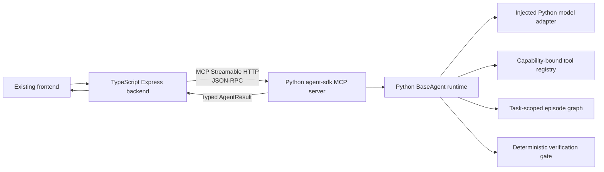

# Python-First BaseAgent Rewrite Through MCP

**Status:** Proposed rewrite; no Python or TypeScript runtime code has been changed by this plan.
**Repository baseline:** `dc466362d97c659293a587d511de1f174f2818ae`, plus the uncommitted TypeScript BaseAgent prototype created in the preceding increment.
**Decision stated by the project owner:** The reusable agent system should be implemented in Python. The existing TypeScript backend should route requests to it through the Model Context Protocol (MCP).

## Recommendation

Replace the uncommitted TypeScript `packages/agent-sdk` prototype with a Python package at the **same repository path**, `packages/agent-sdk`. The Python process will expose the agent runtime as an MCP server. The existing TypeScript backend will become an MCP client and will forward a typed task to the Python service through the standard `run_agent_task` MCP tool.

The recommended transport is **Streamable HTTP over the loopback interface** during development: the Python MCP service listens on `127.0.0.1` and exposes `/mcp`; the TypeScript backend connects as a client. This directly satisfies the requested TypeScript-server-to-Python-server route. The MCP specification defines Streamable HTTP as a single-endpoint HTTP binding for standard JSON-RPC messages, with JSON or request-scoped Server-Sent Events responses. The protocol semantics remain the same across transports.[6] The current official Python SDK documents Streamable HTTP as the transport for a server that listens on a port, while identifying stdio as the default for a locally launched child process.[7]

This architecture retains the framework’s intended separation: Python owns the reasoning-agent execution loop, task-scoped memory, and deterministic verification boundary; TypeScript owns the existing HTTP/UI-facing backend and becomes a deterministic integration client. The framework explicitly distinguishes reasoning agents from deterministic orchestration and contract-level verification modules.[1]

## Architecture



The TypeScript process must not copy the Python execution loop or manually reproduce the Python agent schemas. The Python package will be authoritative for the BaseAgent contract and will expose its typed result through MCP. This follows the framework’s requirement that agent input and output are typed, that the input is a scoped payload rather than the full specification, and that a verification gate runs before the caller accepts output.[2]

## Transport options

| Approach | Trade-offs | Cost | Setup complexity |
|---|---|---:|---:|
| **Streamable HTTP MCP: recommended** | A real Python service listens on `127.0.0.1:<port>/mcp`; the TypeScript backend is a normal MCP client. This matches the requested server-to-server boundary, supports an independently restartable Python service, and is the correct basis for later deployment. It requires service lifecycle handling and a readiness check. | No incremental model cost by itself. | Moderate. |
| **stdio MCP: development-only alternative** | TypeScript launches Python as a child process and exchanges newline-delimited MCP JSON-RPC over standard streams. It is the simplest local learning setup, but the Python process is owned by the TypeScript process and does not form the requested standalone Python server. Standard output must remain protocol-only. | No incremental model cost by itself. | Low. |

The MCP specification states that stdio and Streamable HTTP have identical protocol semantics; they differ in framing, request metadata transport, and lifecycle handling.[6] The official TypeScript SDK describes Streamable HTTP as the recommended route for remote servers and stdio as appropriate for local process-spawned integrations.[8] The recommendation is therefore not a custom RPC protocol; it is a standard MCP boundary selected to match the requested server-to-server topology.

## Python package rewrite

### Package layout

The rewrite will delete the uncommitted TypeScript files currently under `packages/agent-sdk` and replace them with a Python package.

```text
packages/agent-sdk/
├── pyproject.toml
├── README.md
├── src/
│   └── agent_sdk/
│       ├── __init__.py
│       ├── contracts.py
│       ├── context.py
│       ├── episodes.py
│       ├── tools.py
│       ├── model.py
│       ├── base_agent.py
│       ├── verification.py
│       ├── mcp_server.py
│       └── errors.py
└── tests/
    ├── test_contracts.py
    ├── test_context.py
    ├── test_episodes.py
    ├── test_base_agent.py
    ├── test_mcp_server.py
    └── test_typescript_mcp_e2e.ts
```

`pyproject.toml` will use `uv` for environment and dependency management. The environment already provides Python 3.12.3 and `uv`; the current official MCP Python SDK requires Python 3.10 or later.[9] The planned runtime dependencies are the official `mcp` Python SDK and Pydantic. The planned development dependencies are `pytest`, `pytest-anyio`, and any test-only HTTP/process support required by the final integration test.

### BaseAgent contract

Pydantic models will make the BaseAgent contract executable and serializable. They will represent the following document-defined fields: `identity`, versioned `instructions`, `input_schema`, task-specific `tools`, declarative `model_binding`, `output_schema`, `memory_scope`, `termination_policy`, and optional `verification_gate`.[2]

The Python runtime will preserve the agreed semantics from the TypeScript prototype:

1. `BaseAgent.run(task)` accepts exactly one `ScopedAgentTask`.
2. The runtime validates the task’s scoped input before invoking a model adapter.
3. `assemble_initial_context` is a pure deterministic function. It orders agent identity/instructions; then exact task scope, locked interface, instructions, and acceptance criteria; then selected skill content; then only declared tool schemas.[3]
4. The model adapter returns untrusted candidate output or a declared tool call. The runtime alone parses the candidate through the declared Pydantic output model.
5. Tools are deny-by-default. An undeclared tool, invalid tool arguments, or absent executor becomes a typed failure before a side effect occurs.
6. Pre-tool and post-tool hooks are deterministic extension points for policy checks, audit events, and result processing. EDA resource limits and process-tree cancellation remain future tool-executor responsibilities rather than hook responsibilities.[4]
7. An output becomes `completed` only after Pydantic validation and an optional deterministic verification gate pass. A rejected gate returns a terminal typed failure for this increment, as previously approved.
8. The loop ends only with `completed`, `blocked`, `failed`, `cancelled`, or a declared iteration-cap failure. Any configured human/controller escalation is recorded in the result.

### Typed task-scoped memory

The default `InMemoryEpisodeGraph` will model the framework’s episode graph. It contains exploratory and action episodes. It permits only dependencies from an action episode to exploratory episodes consumed by that action. It rejects exploratory-to-exploratory and action-to-action dependencies.[5]

Cross-session memory will remain unsupported by the default store. A definition that requests it must carry a rationale and receive an explicitly injected persistent episode-store implementation. This prevents an accidental downgrade from cross-session memory to volatile task-local state, while respecting the framework’s requirement that task-scoped memory is the default and other scopes need a stated reason.[2]

## MCP surface

The Python MCP service will expose three small, explicit tools in the first increment.

| MCP tool | Input | Result | Purpose |
|---|---|---|---|
| `validate_agent_definition` | A serializable BaseAgent definition | Validated definition metadata or field errors | Lets TypeScript validate user-authored configuration without reimplementing the contract. |
| `assemble_initial_context` | Definition plus one scoped task | Ordered, redacted-for-transport context sections | Demonstrates and tests deterministic context assembly separately from model execution. |
| `run_agent_task` | Definition, task, and allowed runtime options | Typed `AgentResult`, including status, output/reason, episodes, and lifecycle events | The primary TypeScript-to-Python execution route. |

The tool inputs and results will be generated from the Pydantic models. The official Python MCP SDK can derive MCP tool schemas from Python type hints and docstrings, so the server exposes the contract without hand-writing a parallel JSON parser.[9] TypeScript will treat the MCP responses as the remote API boundary and validate result envelopes only; it will not duplicate the whole BaseAgent implementation.

The Python service will define a fixed endpoint and local-only defaults:

```text
http://127.0.0.1:8001/mcp
```

The port must be environment-configurable so tests can use a temporary free port. No public binding, public endpoint, or authentication configuration is part of this rewrite. Before any later non-local deployment, transport security and authorization must be designed explicitly; the Python SDK documentation identifies those concerns as deployment-specific.[7]

## TypeScript MCP client integration

The TypeScript backend currently contains an HTTP application, agent factory, legacy `Agent`, model router, and tool executor, but no MCP client. This rewrite adds a narrow `PythonAgentRuntimeClient` service rather than changing the legacy `Agent` immediately.

The client will use the official TypeScript MCP SDK. That SDK provides a high-level `Client` with `listTools` and `callTool` methods and supports Streamable HTTP and stdio transports.[8] The TypeScript client responsibilities are limited to the following deterministic work:

1. Read the Python MCP URL from a backend configuration field such as `agentRuntime.mcpUrl`.
2. Connect, negotiate capabilities, and cache the tool list for the active service session.
3. Call `run_agent_task` with the validated JSON payload.
4. Validate the returned result envelope, translate connection/protocol errors into the backend error model, and forward the result to existing API/UI code.
5. Close the session cleanly at backend shutdown.

The client will not call a model itself in the Python-first option. The Python runtime owns the model adapter because model binding is part of the BaseAgent contract and is explicitly a provider/model data seam.[2] This prevents a hidden second control plane in TypeScript.

## Model decision required

A real model is necessary for an integration test that demonstrates reasoning rather than only protocol wiring. The TypeScript prototype used a scripted fake model only; it did not test a real provider. The Python rewrite should retain deterministic fake-model tests and add an opt-in real-model test.

| Model-adapter approach | Trade-offs | Cost | Setup complexity |
|---|---|---:|---:|
| **Python OpenAI-compatible adapter: recommended** | Python owns the full BaseAgent loop and model interaction. The adapter reads its endpoint/key from environment variables and obeys `model_binding`. TypeScript remains a thin MCP client. | Depends on the selected model and provider. | Moderate. |
| **TypeScript `ModelRouter` remains the provider adapter** | Reuses existing provider registry, but Python would need a second custom callback path to request model turns. That makes Python no longer the complete agent runtime and weakens the MCP boundary. | Depends on existing router configuration. | High. |
| **No real provider in this increment** | Fully deterministic and free tests, but cannot answer the question of whether a chosen real model can perform a scoped RTL-oriented task. | None. | Low. |

The recommended model test will be explicitly marked as an integration test and skipped unless the selected model identifier and credentials are deliberately configured. It will use a minimal RTL-oriented task: the model must call `read_locked_interface`, return a structured `InterfaceCheckResult`, and pass a deterministic gate that checks output status and exact locked signal identifiers. It will record the model ID, prompt/task hash, tool trace, structured output, and gate outcome. This preserves the framework’s requirement for typed results and deterministic acceptance, while making model performance claims reproducible.[2] [3]

## Validation plan

The rewrite will use layered validation rather than treating one model response as proof of correctness.

| Layer | Test | Pass condition |
|---|---|---|
| Python unit | Contract, context ordering, capability denial, hook ordering, iteration cap, cancellation, verification rejection, and episode edge invariants | `pytest` passes without a model key or running server. |
| Python MCP unit | Official Python in-memory MCP `Client` against the Python `MCPServer` | All three exposed tools return schemas and results through MCP without a port or subprocess. The official SDK documents this in-memory testing approach.[10] |
| Cross-language integration | Start the Python server on a temporary loopback port, then have a TypeScript MCP client list tools and call `run_agent_task` with a deterministic model adapter | The exact structured result, tool trace, and lifecycle status are received by TypeScript. |
| Real-model integration, opt-in | Run the same minimal RTL-oriented task through the selected real provider | The report identifies the exact model, task hash, raw tool trace, result, and gate outcome. A failure remains a recorded failure rather than a hidden retry. |

## Implementation sequence after approval

First, remove the uncommitted TypeScript SDK prototype and create the Python `pyproject.toml`, package skeleton, Pydantic contract models, deterministic context assembler, episode graph, and pure unit tests. Second, add the Python MCP server and its in-memory MCP tests. Third, add the TypeScript `PythonAgentRuntimeClient`, configuration field, and a temporary-port Streamable HTTP end-to-end test. Fourth, implement the chosen Python model adapter and run the explicitly selected real-model test once. Fifth, replace the existing prototype documentation with final Python/MCP documentation and an implementation record that cites the framework pages, MCP protocol, and exact validation result.

## Decisions requested before implementation

1. **Confirm transport:** Approve the recommended loopback Streamable HTTP route (`TypeScript backend → http://127.0.0.1:<configurable-port>/mcp → Python MCP server`) rather than using stdio for the TypeScript integration.
2. **Confirm replacement scope:** Delete the uncommitted TypeScript `packages/agent-sdk` prototype and recreate `packages/agent-sdk` as the Python package. The legacy backend `Agent` remains unchanged in this increment.
3. **Select model strategy:** Approve the recommended Python-owned OpenAI-compatible model adapter, or choose the deterministic-only path for the initial rewrite. If selecting a real model, provide the desired model identifier; the implementation will not assume a paid model or make a performance claim until the opt-in test runs.
4. **Confirm first public MCP surface:** Approve the three tools `validate_agent_definition`, `assemble_initial_context`, and `run_agent_task`.

## References

[1]: /home/ubuntu/upload/Agent-AssistedDesignFrameworkSystemsDesign-updated.pdf "Agent-Assisted Design Framework Systems Design, updated, p. 50, lines 4–14"
[2]: /home/ubuntu/upload/Agent-AssistedDesignFrameworkSystemsDesign-updated.pdf "Agent-Assisted Design Framework Systems Design, updated, p. 51, lines 2–20"
[3]: /home/ubuntu/upload/Agent-AssistedDesignFrameworkSystemsDesign-updated.pdf "Agent-Assisted Design Framework Systems Design, updated, p. 61, lines 2–13"
[4]: /home/ubuntu/upload/Agent-AssistedDesignFrameworkSystemsDesign-updated.pdf "Agent-Assisted Design Framework Systems Design, updated, p. 55, lines 2–14"
[5]: /home/ubuntu/upload/Agent-AssistedDesignFrameworkSystemsDesign-updated.pdf "Agent-Assisted Design Framework Systems Design, updated, p. 62, lines 2–14"
[6]: https://modelcontextprotocol.io/specification/2026-07-28/basic/transports "Model Context Protocol specification: transports"
[7]: https://py.sdk.modelcontextprotocol.io/run/ "MCP Python SDK: running a server"
[8]: https://ts.sdk.modelcontextprotocol.io/ "MCP TypeScript SDK: clients and transports"
[9]: https://py.sdk.modelcontextprotocol.io/ "MCP Python SDK v2: installation and typed tool example"
[10]: https://py.sdk.modelcontextprotocol.io/get-started/testing/ "MCP Python SDK: in-memory server testing"
