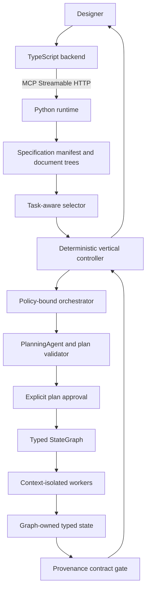

# `agent-design-agent-sdk`

`agent-design-agent-sdk` is the project’s **Python implementation of the BaseAgent runtime, deterministic controller, typed graph harness, and source-preserving specification preprocessing layer**. It is project code, not a wrapper around Claude Code, Manus, or OpenHarness. A reasoning agent executes a single bounded task; planning validation, controller state, graph scheduling, provenance checks, policy, approvals, process supervision, document parsing, and Gate 1 checks are deterministic modules.[1]

Start with the [comprehensive developer handbook](../../docs/agent-sdk-developer-handbook.md) for installation, host integration, provider adapters, governed tools, gates, memory, coordination, observability, developer commands, and maintenance rules. For the implementation-level account of the exact retention solver, structural evidence closure, graph-bound `BaseAgent` executor, exact-reference routing, stage gates, conflict ledger, and frozen comparison baseline, read the [P0–P2 algorithm implementation record](../../docs/p0-p2-algorithm-implementation.md). The [algorithmic approaches catalogue](../../docs/algorithmic-approaches-catalogue.md) remains the historical baseline and complexity map.

The [governed orchestration guide](../../docs/orchestration-guide.md) documents the user-configurable policy layer for named skills, exact model bindings, tools, capability grants, worker profiles, scale and repair limits, approval, host-local subagent bindings, bounded Jev routing advice, persistence, and the deliberately data-only MCP lifecycle.

The [grounded retrieval and structural versioning guide](../../docs/grounded-retrieval-and-versioning.md) documents the 0.15.0 retrieval boundary: Qdrant ranks source references for a frozen snapshot, local hashes and stage policy validate them, Redis is an optional TTL cache only, Gate 1 computes transitive missing-dependency impact, and version locks compare persisted structured snapshots rather than path names.

Framework interoperability is optional and authority-preserving. The
[framework interoperability guide](../../docs/framework-interoperability-guide.md) documents the
LangGraph and LangChain adapters, while the [Jev advisory-evaluation guide](../../docs/jev-advisory-evaluation-guide.md)
defines the redaction, receipt, deterministic-gate, and exploration-ranking boundary. The
[implementation record](../../docs/langgraph-langchain-jev-interoperability-implementation.md)
identifies the delivered modules and validation scope. Install only the selected optional extra:
`agent-design-agent-sdk[langgraph]`, `[langchain]`, `[jev]`, or `[interop]`.

The TypeScript backend is an MCP Streamable HTTP façade. It forwards typed requests to Python and does not duplicate controller, graph, document, policy, or memory semantics.[20] [21]

## Implemented architecture



The controller’s vertical path is typed and explicit: it binds an immutable source snapshot, selects a stage/skill/capability profile, uses deterministic metadata thresholds to route between one-worker and multi-worker execution, presents only a deterministically valid plan for user approval, dispatches an approved graph, requests bounded repair, and escalates unresolved failure. It does not exchange worker dialogue.[2] [3] [4]

`orchestrator.py` adds the configurable composition layer around that controller. It compiles a user-approved `OrchestrationPolicy` and a validated `OrchestrationRequest` into deterministic worker assignments. The user policy bounds named skills, exact model bindings, registered tools, capabilities, profile instances, total agents, concurrent agents, repair attempts, and multi-agent eligibility. An optional receipt-backed Jev advisor may conservatively lift a deterministic single-agent route to a multi-agent route; it cannot lower a deterministic multi-agent route, grant authority, or approve work. Executable bindings remain host-local, so MCP exposes policy/approval persistence but no remote worker-dispatch method.[2] [3]

Lateral coordination is also typed and graph-owned. `StateGraph` persists nodes, edges, statuses, typed results, `GraphSharedState`, discoveries, immutable shared values, and lateral requests together in one run snapshot. A completed producer publishes a **closed exploratory discovery** with source spans, snapshot version, and provenance. A different consumer action requests that discovery; the graph then persists a conditional graph edge. A node receives declared predecessor results and a read-only graph-state copy, never a sibling transcript or arbitrary sibling result. Workers do not directly message each other and do not exchange transcripts.[4] [5]

## Modules and boundaries

| Module | Responsibility | Evidence basis |
|---|---|---|
| `orchestration.py`, `controller_runtime.py` | Controller phases, deterministic complexity routing, explicit plan approval, dispatch, bounded repair/escalation, and durable controller event records. | Orchestrator, routing, approval, and repair flow.[2] [3] [6] |
| `orchestrator.py` | User-configurable compilation of selected skills, named exact model bindings, tool/capability profile grants, total/parallel agent and repair limits, deterministic/Jev routing, durable policy/record persistence, approval-gated host binding validation, and graph-bound execution. MCP can persist this lifecycle but cannot receive executable bindings. | Planning-time profile binding and deterministic routing/approval flow.[2] [3] |
| `graph.py`, `graph_agent_executor.py`, `shared_state.py`, `coordination.py` | Graph-owned substrate snapshots, exact-reference discovery routing, exploratory discoveries, immutable shared values, lateral requests, conditional edges, typed conflict ledger, deterministic wave scheduling, host-injected `BaseAgent` node execution, canonical provenance, fan-in contracts, and single-snapshot rehydration. `RunSharedState` remains a legacy compatibility type, not the runtime coordination store. | Typed state graph and cross-worker episode rule.[4] [5] |
| `specifications.py` | YAML-first manifest ingestion and ordered, source-referenced document trees. Parsers cover text/declarative formats, DOCX paragraphs/tables/drawing placeholders, PDF page text/image placeholders, CSV/XLSX tables, YAML/JSON, XML/SVG/draw.io, and VSDX page XML. | Unified manifest and format-specific processing design.[7] [8] [9] |
| `context_selection.py`, `retrieval.py`, `evidence_graph.py` | Stage-to-category pruning; provenance-grounded retrieval in which Qdrant may rank candidate source references but local frozen trees validate them before deterministic admission; optional Redis cache of bounded references only; and a source-backed structural evidence graph that computes mandatory relation closure before exact residual-budget packing. | Task-aware context loading, stage matrix, and source-traceable state graph.[4] [10] [11] [12] |
| `specification_gate.py`, `dependency_graph.py` | Deterministic absence, traceability, circular-dependency, and verifiability checks; transitive reverse-reachability blast radius for missing references; designer-authorized soft lock; and persisted Gate 1 artifacts. | Gap taxonomy and deterministic graph traversal.[13] [14] [15] |
| `planning.py`, `coordination.py` | `PlanTask` dependency proofs, graph startup, integrity-checked rehydration, cancellation, and typed terminal results. | Plan validation and graph execution design.[17] [4] |
| `tool_registry.py`, `policy.py`, `approvals.py`, `supervisor.py` | Closed capabilities, path containment, typed approval, and registered-command supervision. Process outcomes are mapped deterministically: timeout, cancellation, resource-limit, and non-zero exit become typed tool failures rather than successful payloads. | Tool/hook and watchdog boundary.[18] |
| `telemetry.py`, `metrics.py`, `base_agent.py`, `controller_runtime.py` | SQLite-backed append-only event ledger, standard metric catalogue, explicit availability states, per-run hash chain, aggregate trace reports, BaseAgent wall-clock watchdogs, and controller/graph lifecycle telemetry. The ledger records structured outcomes and evidence pointers, not hidden model reasoning. | Watchdog authority and accountability/provenance requirements.[18] [22] [23] |
| `audit_log.py` | Bounded, redacted, hash-linked JSONL interaction records and rendered Markdown transcripts. Provider-visible structured turns, tool call/result evidence, verification, escalation, and terminal outcomes are review evidence; the log is never model working memory. | The proposal requires traceability of prompts, outputs, corrections, and PPA deltas; structural checkpoints omit raw transcripts.[19] [22] [25] |
| `core_tools.py`, `tool_registry.py` | Typed run-root-contained file/evidence tools, bounded result-handle retrieval, untrusted public-web research, notebook JSON edits, human questions, and named registered-command dispatch. Generic shell, local-network web access, and runtime-discovered arbitrary tools are absent. | OpenHarness's typed-tool, read-only/approval, and untrusted-web patterns, adapted to the system-design capability/watchdog boundary.[18] [26] |
| `verification.py` | Built-in gates plus a host-owned `VerificationGateRegistry` that accepts named sync or async local callbacks with fixed positional/keyword arguments. | Deterministic validation boundary following model output and tool lifecycle hooks.[18] |
| `profiler.py` | Hash-identified per-run wall-clock and process-CPU profiles for model turns, context projection, tools, and verification; profiles exclude prompts, tool payloads, and hidden reasoning. | Accountable measurement and trace-reporting requirements.[22] [23] |
| `git_versioning.py` | Scoped local Git state inspection; snapshot-backed requirement-ID/field/dependency-edge version classification; approved annotated specification tags; verifiable lock records; and approved variant Git worktrees. Remote push, force-update, merge, and removal are intentionally absent. | SemVer, complete specification tags, deterministic structural comparison, and isolated variant worktrees.[16] |
| `memory.py`, `optimization.py` | Task episode lifecycle, cross-agent dependency metadata, default exact dependency-closed PCKP retention with a certificate, rooted-forest dynamic-programming fast path, explicit PASK diversity heuristic, greedy baseline, manifest-protected compaction, deadlock dossiers, and structural checkpoints. | Episode graph and compaction rules, extended by the approved PASK/PCKP roadmap.[5] [19] [27] |
| `project_state.py` | Bounded project working state, declared stage schemas, current artifact/work-item status, human-owned decisions, open questions, blockers, evidence references, hash-linked state events, and atomic file persistence. | State-graph substrate and non-transcript worker coordination.[4] [25] |
| `context_projection.py`, `base_agent.py`, `model.py` | Dependency-validated tool batches, serial/parallel-safe scheduling, opaque full-result journal handles, pre-turn episode compaction, **state-only model context**, and provider-owned opaque continuation state. | Deterministic next-context construction and typed episode compaction.[24] [19] [25] |

## Specification preprocessing

A manifest points to documents rather than duplicating them. Each processed `DocumentTree` preserves reading order and carries a `SourceRef` with document identifier, path, content hash, format, and source location. The resulting context can therefore be traced to a page, paragraph, table, worksheet/range, line, XML location, VSDX package part, or image position.[7] [9]

Mixed documents are processed text-first. Image nodes retain neighboring text and are routed through a provider-neutral `VisionAdapter`. `ScriptedVisionAdapter` supports controlled tests and `UnconfiguredVisionAdapter` returns `review-required`. A valid high-confidence typed proposal is accepted after at most three attempts. A real multimodal API is intentionally not invoked until a provider/model identifier is supplied.[8] [9]

Task-aware context selection does not load the full corpus. It first prunes source trees using the documented stage matrix, then selects nodes with a scope-pointer or normalized keyword match. The optional grounded retrieval layer may rank additional candidate references, but it filters them by frozen snapshot/category and resolves each against a local `SourceRef` hash/location before the same stage policy admits a node. Redis, when explicitly configured, caches only digest-keyed retrieval results and never becomes a source of specification truth. The selection result retains source references rather than generating a lossy summary.[10] [11] [12]

## Gate 1 artifacts

The `Gate1ArtifactStore` persists the approved handover under the configured `specifications/` root:

```text
specifications/
├── processed/<document-id>.document.yaml
├── unified-specification.yaml
├── dependency-graph.yaml
├── gap-report.yaml
├── plans/plan-<n>.yaml
└── version-metadata.yaml
```

Only a designer decision can soft-lock the specification. If gaps remain, the API rejects the lock unless the caller supplies both designer approval and an explicit `proceed_with_gaps` override. This records the warning rather than silently treating incompleteness as acceptance.[6] [15]

## Watchdog, telemetry, Git versioning, and reports

`ProcessSupervisor` is a tool-layer watchdog, not a generic shell. A closed `CommandTemplate` controls the executable, working directory, wall-clock deadline, bounded output capture, optional POSIX CPU/address-space/file-size limits, and retry eligibility. A new session/process group is terminated with `SIGTERM`, then `SIGKILL` only if necessary. The record names the PID/PGID, duration, exit kind/code/signal, termination path, output totals/truncation, and enforced or unsupported resource controls. The runtime does **not** claim cgroup isolation; the current portable implementation explicitly reports only limits it was able to apply.[18]

`AgentWatchdogPolicy` optionally bounds the entire BaseAgent invocation, individual model turns, and tool/hook calls. A timeout has a stable terminal reason (`WATCHDOG_RUN_DEADLINE`, `WATCHDOG_MODEL_TIMEOUT`, or `WATCHDOG_TOOL_TIMEOUT`) and is emitted as a durable lifecycle fact. Only operations declared idempotent in a `RetryPolicy` may be retried, and the default policy does not retry mutating actions.

`TelemetryStore` creates `.agent-telemetry/telemetry.sqlite3` under the configured run root. Every event carries ordered run/task/controller/agent correlation, UTC and monotonic timestamps, actor/authority, status, evidence links, a payload hash, and the previous event hash. `STANDARD_METRIC_DEFINITIONS` automatically registers attempt/recovery/tool/verification/escalation/context/watchdog/profile metrics and the proposal’s research metric definitions. The report aggregates only available observations by each registered formula; it preserves unavailable values and their reasons instead of substituting zero. Provider input/output/cache/reasoning/context-window token counters are recorded only from `ModelTurnResponse.usage`; the deterministic context estimate and the provider counters are explicitly labelled differently.[22] [23]

`AuditTranscriptStore` writes `.agent-audit-logs/<run>.jsonl` and can render a review-only Markdown transcript. It records bounded, redacted task instructions, provider-visible structured model turns, tool arguments/results or journal handles, verification, escalation, and terminal/profile events. Secret-bearing keys are redacted and hidden-reasoning fields are rejected. Audit history is not replayed to the model and checkpoints remain structural, so tracing does not reintroduce context growth.[19] [25]

`core_tool_definitions()` supplies typed opt-in declarations for `read_file`, `glob`, `grep`, `read_artifact`, `grep_artifact`, `get_tool_result`, `write_draft`, `edit_draft`, `notebook_edit`, `diff_declared_artifacts`, `web_fetch`, `web_search`, `sleep`, `brief`, `ask_human_question`, and `run_registered_command`. `HarnessToolRegistry` applies the existing capability/approval policy before `CoreToolDispatcher` runs them. Files cannot escape the run root; output changes require a declared path; web fetch rejects non-HTTP(S), loopback, private, link-local, multicast, reserved, and redirected-to-private targets; every web result is marked untrusted; and process execution accepts only a named `CommandTemplate`, never a raw command string.[18] [26]

## Developer tools and source quality

The modular `agent_sdk.developer_tools` package supplies a read-only public API catalogue, JSON/YAML contract validator, durable-run integrity inspector, and closed Ruff quality checker. Its command-line entry point is `agent-sdk-dev`. These tools do not invoke models, tools, callbacks, commands, or MCP operations; they only inspect declared API, local contracts, stored evidence, and checkout source quality. See the [developer handbook](../../docs/agent-sdk-developer-handbook.md#9-inspect-observability-without-re-executing-work) for commands and supported artifact types.

The runnable [developer-tools workflow](examples/developer_tools_workflow.py) creates a deterministic local run and then catalogues public API, validates a contract, and verifies evidence chains without re-executing agent work.

`SpecificationVersionService` accepts only Git repositories rooted beneath the configured runtime root. A soft-lock tag is a local annotated `vMAJOR.MINOR.PATCH` tag created only after an attributable approved `create-specification-lock` request, a clean repository check, Gate 1 soft-lock metadata, a matching unified-specification digest, and version-bump validation. Each lock persists a content-addressed structured specification/dependency-graph snapshot. Later classification compares IDs, existing requirement text/category/fields, and dependency edges; it no longer infers a version bump from changed path names. A legacy tag without such a snapshot is refused for automatic classification until an approved baseline is created. The lock record binds Git `HEAD`, tree ID, tag object ID, Gate 1 hashes, classification rationale, and the approval record. `create-variant-worktree` additionally requires an approved `create-variant-worktree` request and a pre-existing specification tag. It creates an isolated local worktree below the runtime ledger; it never pushes, merges, deletes, or force-updates.[16]

## Bounded tool batches and model context

The BaseAgent loop accepts a backward-compatible single `tool-call` turn and a `tool-batch` turn. A batch has unique correlated call identifiers and an acyclic `depends_on_call_ids` relation. The scheduler runs ready `parallel-safe` calls concurrently. It serializes every `serial` tool, preserves the model-request order in the returned observations, and does not dispatch a dependent call until each declared prerequisite succeeds. A policy denial, malformed tool request, missing executor, watchdog timeout, or hook lifecycle failure is terminal for the current task. This preserves the BaseAgent requirement that the harness, not a model, owns tool authorization and bounded execution.[18]

Complete `ToolExecutionResult` payloads are retained in a `ToolResultJournal`. `FileToolResultJournal` persists full structured evidence beneath `.agent-tool-results/`; `InMemoryToolResultJournal` is the deterministic default for a task invocation. A `ProjectedToolResult` remains available to the harness for correlation, telemetry, and an eventual typed evidence-retrieval operation, but it is **not** replayed as normal working context for the next model call.

### State-first working memory

The normal BaseAgent working memory is `ProjectState`, not a model-visible transcript. It contains the current declared stage/schema, stage fields, artifact states, work-item states, human decisions, explicit open questions, blockers, last deterministic action summary, monotonic step count, and bounded evidence references. It does **not** contain raw tool logs, episode payloads, hidden model reasoning, or conversational history. Each state entry must cite a `StateEvidence` identifier such as a specification span, graph result, artifact, or opaque result handle.[4] [25]

The harness owns state reduction. A tool outcome updates `last_action` mechanically and, only when a `write_draft` result explicitly supplies `artifact_id` plus `relative_path`, updates that artifact state. A terminal BaseAgent result mechanically updates the task work-item state. A graph-node terminal result similarly updates a controller-bound project state. Human decisions are accepted only through a `HUMAN` transition and unresolved questions are explicit records, so a model cannot assert an ungrounded fact by mutating working state. Every transition increments a revision and creates a hash-linked `ProjectStateEvent`; `FileProjectStateStore` atomically persists current state and events under `.agent-project-state/`.

Immediately before every model call, `ContextProjector` still runs manifest-safe episode compaction. `ProjectStateProjector` independently enforces the model-visible `project_state_token_budget`: it retains the current stage, stage fields, decisions, questions, blockers, last action, and newest artifact/work-item entries that fit. If mandatory state fields alone exceed that budget, BaseAgent returns `PROJECT_STATE_BUDGET_EXCEEDED` rather than silently dropping them. Episodes, result journals, and telemetry are **audit/recovery evidence**, rather than ordinary model working memory. The `ModelContext` receives immutable scoped prompt data, a bounded `ProjectStateView`, its context-budget metadata, and opaque provider continuation only; `observations` and episode summaries are intentionally empty in normal state-first calls. This makes transcript growth independent of the number of prior tool calls while retaining a traceable evidence chain.[19] [25]

`CompactionStrategy.EXACT_PCKP` is now the default retention selector. It optimizes an additive static integer utility under immediate prerequisite constraints, uses a deterministic exact branch-and-bound search with rational upper bounds for a general dependency DAG, and uses a capacity-indexed dynamic-programming path only for verified rooted forests. A solver dossier records the problem hash, selected closure, status, node count, and optimality certificate. `CompactionStrategy.PASK` remains an explicit deterministic diversity heuristic; `GREEDY_BASELINE` remains for controlled comparison. Protected/open/manifest-incomplete dependency closures are never silently dropped. See the [P0–P2 implementation record](../../docs/p0-p2-algorithm-implementation.md) and [context-compaction/coordination explainer](../../docs/context-compaction-and-coordination.md).[27] [28]

`ProviderContinuation` and `ModelTurnResponse` provide an opaque carrier for provider-native response, session, or compaction state. The BaseAgent forwards that state unchanged; it does not interpret, construct, or expose provider-specific continuation payloads. A real provider adapter remains unimplemented until the project selects a provider and model identifier.

## MCP tools

The MCP server exposes BaseAgent, graph-run, controller, lateral-discovery, provenance, preprocessing, context-selection, Gate 1 validation, soft-lock, and **data-only orchestration** tools. The orchestration lifecycle is `prepare_orchestration`, `get_orchestration`, `submit_orchestration_for_approval`, `approve_orchestration`, and `cancel_orchestration`. There is intentionally no remote orchestration-dispatch tool: model adapters, tool callbacks, credentials, verification callbacks, and `GraphAgentBindingFactory` remain host-local. State-first working memory is available through `initialize_project_state`, `get_project_state`, `record_human_project_decision`, and `open_project_question`. Key controller lifecycle tools are `create_controller`, `submit_controller_plan`, `approve_controller_plan`, `dispatch_controller`, `record_controller_node_result`, `publish_exploratory_discovery`, `request_lateral_dependency`, `verify_provenance_contract`, `process_specification_manifest`, `select_task_context`, `validate_gate_one`, and `soft_lock_specification`.

The observability surface adds `list_telemetry_runs`, `get_telemetry_events`, `get_audit_log`, `render_audit_transcript`, `register_metric_definition`, `list_metric_definitions`, `record_metric_observation`, `get_telemetry_metrics`, and `create_telemetry_report`. The local-versioning surface adds `get_git_repository_state`, `classify_specification_version`, `create_specification_git_lock`, and `create_variant_worktree`. The TypeScript `/api/agent-runtime` façade exposes matching read/query routes and capability/approval payloads. The existing frontend telemetry panel reads the newest runtime trace and metrics to show event count, integrity-chain status, selected metric availability, and an ordered event tail.

## Using the SDK in another Python project

The package is a source-distributed Python library under the repository’s MIT license. It is not published to PyPI in this increment. Install it from a checked-out repository or directly from the Git source:

```bash
# From a local clone
uv pip install ./packages/agent-sdk

# Or from Git
uv pip install "git+https://github.com/MikejR2904/agent_assisted_design.git#subdirectory=packages/agent-sdk"
```

The stable consumer entry point is `import agent_sdk`. A host application supplies an `AgentDefinition`, a scoped task, an `AgentModel` adapter for its selected provider, an optional declared-tool executor, and optional local extensions. `ScriptedModel` is deliberately a test adapter; it is not a model provider.

The runnable [governed core-tools example](examples/governed_core_tools.py) demonstrates direct host construction of a run-root-contained dispatcher. An agent host normally uses `HarnessToolExecutor`, which applies `CapabilityPolicy` and approvals before reaching that dispatcher.

The runnable [local orchestration example](examples/orchestration.py) shows the full policy → prepare → explicit approval → host binding → graph execution path with `ScriptedModel`. It is a deterministic host-binding demonstration, not a real provider or EDA execution claim.

The runnable [grounded retrieval example](examples/grounded_retrieval.py) demonstrates the offline lexical fallback, frozen snapshot/category filtering, local `SourceRef` verification, and deterministic stage admission. It does not contact Qdrant, Redis, or an embedding provider.

### Custom verification gates

`verification_gate_id` in `AgentDefinition` is only a stable name. The embedding application, not a model or an MCP payload, registers its implementation. `VerificationGateRegistry.register_callable()` accepts a sync or async callback whose first input is `VerificationContext`, followed by fixed local `*args` and `**kwargs`. The callback may return `VerificationDecision`, `bool`, or `(bool, reason)`. BaseAgent invokes it only after JSON-schema output validation and bounds it with `AgentWatchdogPolicy(verification_timeout_seconds=...)` when configured.

```python
from agent_sdk import VerificationContext, VerificationGateRegistry

async def require_check(context: VerificationContext, required: str) -> tuple[bool, str | None]:
    checks = context.output.get("checks", []) if isinstance(context.output, dict) else []
    return (required in checks, None if required in checks else f"Missing {required}.")

gates = VerificationGateRegistry()
gates.register_callable("require-lint", require_check, "lint")
```

Callback configuration is local process state. It is never serialized into an agent definition, sent over MCP, injected into model context, or logged by the profiler. This keeps acceptance policy host-owned and prevents model-selected arbitrary Python execution. The runnable [consumer example](examples/custom_verification_and_profiling.py) demonstrates construction, profiling, and profile export.

### Runtime profiler

Pass `AgentRunProfiler()` to `BaseAgent` to receive a structured profile in `AgentResult.profile`. It contains monotonic wall duration, process CPU duration, and bounded spans for context projection, each model turn, each tool call, verification, and the overall run. `profiler.write_json(path)` atomically exports the completed record. Profile attributes reject hidden-reasoning keys and have a 4,096-character bound; only outcome classifications and identifiers belong there. The telemetry ledger receives a compact `agent.profile-completed` event containing the profile integrity hash and aggregate phase counts.

## Local validation

From `packages/agent-sdk`:

```bash
uv sync --all-groups
uv run agent-sdk-dev quality .
uv run pytest
```

Start a loopback-only MCP service with an explicit run root and specification root:

```bash
AGENT_RUNTIME_HOST=127.0.0.1 \
AGENT_RUNTIME_PORT=8001 \
AGENT_RUNTIME_RUN_ROOT=.agent-runtime \
AGENT_SPECIFICATION_ROOT=specifications \
uv run python -m agent_sdk.mcp_server
```

The backend uses `AGENT_RUNTIME_MCP_URL`, defaulting to `http://127.0.0.1:8001/mcp`, and mounts its HTTP façade beneath `/api/agent-runtime`.

## Deliberate limitations

The package is **not yet an autonomous RTL-to-GDSII flow**. Tests use `ScriptedModel`, `ScriptedVisionAdapter`, controlled source files, and controlled subprocesses. No real LLM, multimodal model, Verilator, Yosys, OpenROAD, or OpenSTA binary has been invoked. Registered EDA commands remain disabled until the project specifies the executable, environment, resource policy, and manifest contract.

The present parser records image positions and associated context but does not persist extracted binary assets or claim to understand any diagram without an accepted vision-adapter proposal. SystemRDL, SDC, and UPF are source-preserving line/statement inputs in this increment; semantic compilers are not yet bound. The Gate 1 implementation deterministically checks absence, traceability, and verifiability. Ambiguity, semantic inconsistency, and unstated-assumption analysis remain typed model-needed categories, not proven checks, until a model is selected.

Graph and shared-state snapshots rehydrate after a process restart. Orchestration policies and records also rehydrate, but automatic resumption of a real worker executor is intentionally unavailable: the host must re-register the approved model, tool, verification, and graph-binding callbacks. Persistent approval-registry rehydration, multi-process locking, cgroup/container-level resource containment, public MCP authentication, remote/protected Git operations, real EDA report parsers, and stage-specific contracts beyond RTL remain separate increments. The telemetry/reporting substrate is implemented, but all model/EDA/PPA/human-correction statistics remain explicitly unavailable until their corresponding real observations are supplied.

The v0.8.0 extension API is Python-process local. Custom verification callbacks therefore cannot be registered through the public MCP/HTTP route, are not sandboxed, and should be deterministic, bounded, and trusted by the embedding application. The profiler measures SDK-side elapsed/process CPU time; it does not claim remote model latency decomposition, EDA resource use, or PPA measurements without explicit external observations. Provider token/context metrics become available only when a real adapter returns a provider-reported `ProviderUsage`. The project-state reducer is intentionally generic. Its first stage schema is caller-declared and it does not yet enforce a distinct minimum field set for every RTL, synthesis, place-and-route, timing, or signoff stage. Multi-process project-state locking, externally authenticated human identity at the MCP/HTTP boundary, conflict-resolution policies for concurrent controller revisions, real provider-native continuation adapters, Sandbox/Desktop/SSH execution targets, target-aware tool filtering, image-generation/OCR providers, LSP integration, persistent schedules/tasks/teams, and dynamic MCP tool exposure remain separate increments.

## References

[1]: /home/ubuntu/upload/Agent-AssistedDesignFrameworkSystemsDesign-updated.pdf "Agent-Assisted Design Framework Systems Design, updated, pp. 50–51, lines 4–14 and 2–20"
[2]: /home/ubuntu/upload/Agent-AssistedDesignFrameworkSystemsDesign-updated.pdf "Agent-Assisted Design Framework Systems Design, updated, p. 41, lines 2–12"
[3]: /home/ubuntu/upload/Agent-AssistedDesignFrameworkSystemsDesign-updated.pdf "Agent-Assisted Design Framework Systems Design, updated, p. 42, lines 2–13"
[4]: /home/ubuntu/upload/Agent-AssistedDesignFrameworkSystemsDesign-updated.pdf "Agent-Assisted Design Framework Systems Design, updated, p. 60, lines 2–19"
[5]: /home/ubuntu/upload/Agent-AssistedDesignFrameworkSystemsDesign-updated.pdf "Agent-Assisted Design Framework Systems Design, updated, p. 63, lines 2–26"
[6]: /home/ubuntu/upload/Agent-AssistedDesignFrameworkSystemsDesign-updated.pdf "Agent-Assisted Design Framework Systems Design, updated, pp. 43–44, lines 2–11 and 2–27"
[7]: /home/ubuntu/upload/Agent-AssistedDesignFrameworkSystemsDesign-updated.pdf "Agent-Assisted Design Framework Systems Design, updated, pp. 22–23, lines 2–12 and 2–48"
[8]: /home/ubuntu/upload/Agent-AssistedDesignFrameworkSystemsDesign-updated.pdf "Agent-Assisted Design Framework Systems Design, updated, pp. 24–28, lines 2–12, 2–12, 2–11, 2–30, and 2–16"
[9]: /home/ubuntu/upload/Agent-AssistedDesignFrameworkSystemsDesign-updated.pdf "Agent-Assisted Design Framework Systems Design, updated, pp. 29–30, lines 2–11 and 6–16"
[10]: /home/ubuntu/upload/Agent-AssistedDesignFrameworkSystemsDesign-updated.pdf "Agent-Assisted Design Framework Systems Design, updated, p. 31, lines 2–10"
[11]: /home/ubuntu/upload/Agent-AssistedDesignFrameworkSystemsDesign-updated.pdf "Agent-Assisted Design Framework Systems Design, updated, p. 32, lines 1–32"
[12]: /home/ubuntu/upload/Agent-AssistedDesignFrameworkSystemsDesign-updated.pdf "Agent-Assisted Design Framework Systems Design, updated, p. 33, lines 2–20"
[13]: /home/ubuntu/upload/Agent-AssistedDesignFrameworkSystemsDesign-updated.pdf "Agent-Assisted Design Framework Systems Design, updated, p. 38, lines 2–29"
[14]: /home/ubuntu/upload/Agent-AssistedDesignFrameworkSystemsDesign-updated.pdf "Agent-Assisted Design Framework Systems Design, updated, p. 39, lines 2–27"
[15]: /home/ubuntu/upload/Agent-AssistedDesignFrameworkSystemsDesign-updated.pdf "Agent-Assisted Design Framework Systems Design, updated, p. 48, lines 2–13"
[16]: /home/ubuntu/upload/Agent-AssistedDesignFrameworkSystemsDesign-updated.pdf "Agent-Assisted Design Framework Systems Design, updated, pp. 45–47, lines 2–13, 2–13, and 2–16"
[17]: /home/ubuntu/upload/Agent-AssistedDesignFrameworkSystemsDesign-updated.pdf "Agent-Assisted Design Framework Systems Design, updated, pp. 58–60, lines 2–22, 2–30, and 2–19"
[18]: /home/ubuntu/upload/Agent-AssistedDesignFrameworkSystemsDesign-updated.pdf "Agent-Assisted Design Framework Systems Design, updated, pp. 54–55, lines 2–12 and 2–14"
[19]: /home/ubuntu/upload/Agent-AssistedDesignFrameworkSystemsDesign-updated.pdf "Agent-Assisted Design Framework Systems Design, updated, p. 64, lines 2–21"
[20]: https://modelcontextprotocol.io/specification/2026-07-28/basic/transports "Model Context Protocol transports"
[21]: https://py.sdk.modelcontextprotocol.io/ "MCP Python SDK"
[22]: /home/ubuntu/projects/agent-assisted-design-172ab82b/Human-Agent Collaboration in Logical to Physical Design of Decoupled RISC-V Matrix Accelerators.pdf "Human-Agent Collaboration proposal, pp. 30–32, lines 59–70, 76–87, and 89–99"
[23]: /home/ubuntu/projects/agent-assisted-design-172ab82b/Human-Agent Collaboration in Logical to Physical Design of Decoupled RISC-V Matrix Accelerators.pdf "Human-Agent Collaboration proposal, pp. 33–35, lines 101–150"
[24]: /home/ubuntu/upload/Agent-AssistedDesignFrameworkSystemsDesign-updated.pdf "Agent-Assisted Design Framework Systems Design, updated, p. 61, lines 2–16"
[25]: /home/ubuntu/upload/pasted_content.txt "State-based working-memory proposal, lines 23–113 and 137–148"

[26]: https://github.com/HKUDS/OpenHarness/tree/9b2efd795c6aa09f88b0c257d269a9e518da6ae7/src/openharness/tools "OpenHarness typed-tool registry and implementations, inspected 23 September 2026"
[27]: /home/ubuntu/upload/pasted_content_2.txt "User-approved PASK proposal, lines 19–70"
[28]: https://doi.org/10.1145/3829441.3829513 "Dependency-Aware Chain-of-Thought Compression for Financial Reasoning; dynamic-programming dependency-constrained selection, not a greedy equivalence claim"
